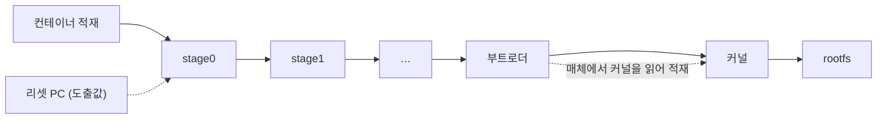

# sboot-rehost

모바일 기기 펌웨어를 QEMU 위에서 **원본 바이너리 그대로** 실행시키는 Claude Code 플러그인.

부트로더 컨테이너를 한 번 적재하고, 첫 스테이지부터 커널이 rootfs 를 마운트할 때까지
**하나의 연속 실행**으로 간다. 다음 단계 적재는 펌웨어 자신의 코드가 한다.



---

## 설치와 사용

```
/plugin marketplace add hyu-sslab/sboot-rehost
/plugin install sboot-rehost@sboot-rehost-marketplace
```

```
/sboot-rehost:init                  설치 후 1회. 옛 환경 정리 + QEMU 빌드 (약 18분)
_inbox/ 에 펌웨어 배치
/sboot-rehost:start [F1|F2|F3]      인식부터 검증까지 자율 진행
/sboot-rehost:status                진행 확인
/sboot-rehost:export                재현 키트
```

| 등급 | 도달 목표 |
|---|---|
| **F1** | 부트로더 체인 동작. 스토리지 모델 없이 도달 가능 |
| **F2** | 커널이 **실제로 실행** (커널만 낼 수 있는 줄이 관측됨) |
| **F3** | rootfs 마운트까지 완주 |

- `kernel_entry`: 부트로더가 자기 커널 점프 줄(부트로더마다 다른 도출값)을 출력
- `kernel_alive`: 커널이 자기 배너 등을 출력. **F2 는 이것을 요구한다.** UART 가 아니라
  게스트 RAM 의 커널 로그(메모리 덤프 채널)로 관측하는 펌웨어도 있다
- 입력 표면(셸·fastboot)은 선택 칸이다. 없는 부트로더는 입력 없이 커널까지 간다
- 검증이 우회된 채 도달한 칸은 `reached_bypassed` 이고, 보고는 **"F2 (verify_ok 우회 N건)"** 으로 쓴다

---

## 검증

| # | 게이트 | 통과 조건 |
|---|---|---|
| 1 | 소스 대조 | 머신 소스가 출력하는 문자열이 콘솔에 없다 |
| 2 | 출력 출처 | 콘솔의 고정 문자열이 펌웨어 이미지 안에 있다 |
| 3 | 입력 출처 | 머신이 자기 수신 버퍼를 채우지 않는다 |

셋 다 통과하면 `VERIFIED`, 하나라도 실패하면 `UNVERIFIED`.

체인 트레이스 · 검증 양방향 · 스토리지 이중 구동 · 우회 기록은 측정해서 보고만 한다.

**검증 우회 보고**는 게이트가 아니지만 판정 문구에 반드시 병기한다. 펌웨어의 검증 결과를
바꾸는 우회가 있으면 `VERIFIED (출처 검증 통과) · 검증 우회 N건 · verify_ok: reached_bypassed`
이다. 게이트가 답하는 것은 "콘솔이 펌웨어에서 나왔는가"이고, 이 보고가 답하는 것은
"펌웨어의 검증이 실제로 계산됐는가"다.

### 지키는 것

- 추측 스텁 금지. 특히 적응형 토글은 다른 펌웨어에서 재현되지 않는다
- 우회는 우회로 표기 (대상 · 이유 · 방법 · 부작용). 부작용을 비우면 무효
- 도달하지 못한 지점은 그렇게 기록
- 회차당 변경 1건. 전문가 fixer 의 변경은 소스 파일 하나 · hunk 3개 이내다. 담당이 없는 정지점에 마지막으로 가는
  `fixer-general` 은 하나의 일관된 메커니즘이면 여러 곳 · 여러 파일을 한 회차에 고친다 (`CHANGE_SCOPE=general`: 파일 · hunk
  검사만 건너뛰고 우회 기록 검사는 전문가와 같다)
- 검증 결과 자체는 위조하지 않는다. 예외는 해시를 하드웨어 엔진이 계산하는 펌웨어 하나뿐이고
  **사용자가 아직 승인하지 않은 잠정 예외**다. 도출된 사실(`STATIC.md` 의 `hash_engine`)이 있어야 열리고,
  엔진 모델링이 먼저이며 우회하면 라벨과 건수를 병기한다. 그 행이 있는지와 모양은 `check_change.sh` 가
  확인해 없으면 반려하지만, **누가 썼는지와 엔진 모델링이 정말 불가능했는지는 기계가 확인하지 못한다**
  ([CLAUDE.md](CLAUDE.md) §11)

---

## 정지

| 코드 | 뜻 |
|---|---|
| `BLOCKED_VERSION` | 로드된 플러그인이 최신이 아님 |
| `BLOCKED_ENV` | 실행 환경 미비, 또는 환경 매니페스트 불일치. `init` 에서는 apt 설치가 필요한데 sudo 가 비밀번호를 요구함 (설치 전에 멈추고 실행할 `apt-get` 줄을 안내) |
| `BLOCKED_ARCH` | 진입 시그니처(GFH 진입 · 페이로드 선두 벡터 테이블 · crt0)를 찾지 못함. 아키텍처 자체는 `--detect-arch` 로 도출하고 `unknown` 을 기본값으로 대신하지 않는다 |
| `BLOCKED_CARVE` | 컨테이너가 부분 추출 (판정이 `false` 일 때만. 기준이 없는 계열은 `null` 이고 정지하지 않는다) |
| `BLOCKED_NO_INPUT_PATH` | 회차가 입력을 기다리며 멈췄는데 입력 경로 없음 |
| `BLOCKED_ASSET` | F2 이상인데 파이프라인이 `02_unpacked` 에서 적재한 뒤에도 커널 자산 없음 |
| `BLOCKED_KO` | `.ko` 부재이고 커널 빌트인도 아님 (F2 이상에서 분석가가 저장소 드라이버 없음으로 보고) |
| `BLOCKED_BUILD` | 재빌드 실패 |
| `BLOCKED_TEE` | 시큐어 월드. 설계상 범위 밖 |
| `EXHAUSTED` | 시도 소진 |

정지하면 `RESUME.md` 가 자동 생성된다. 도달 지점, 마지막 지문, 시도한 변경과 그 효과,
아직 안 써본 수단, 마지막 회차의 로그 경로, 재개 명령이 들어간다 (진행 가이드의 몇 단계인지는 적지 않는다: 재개하면
칸에서 다시 판단한다). **정지는 인계이며 재개 가능하다.** 재개하면 회차 번호는 마지막 번호 다음부터 이어진다.

---

## 현재 상태

| 항목 | 상태 |
|---|---|
| 결정론 계층 (스크립트 · 검문 · 기록) | 동작. 전체 `tests/smoke.sh` 와 영역별 시험 `tests/parts/*.sh` 가 통과한다 (측정한 개수는 [변경 이력](CHANGELOG.md)). 전부 가짜 QEMU 와 합성 입력으로 돈 것이다 |
| 파이프라인 배선 | 합성 에이전트로 파이프라인 전체를 돌리고, 파이프라인이 내보내는 셸 명령을 실제 스크립트에 실행하는 시험(`tests/parts/pipeline_family.sh`, 에이전트 대본과 시나리오는 `tests/pipeline_sim/`)으로 확인 |
| 실제 QEMU 실행 | **없음**. 실제 QEMU · 실제 LLM · 실제 워크플로 런타임으로 돌린 적이 없다 |
| 머신 템플릿 | `machine_full.c.tmpl` · `machine_mixed_arch.c.tmpl` 은 더미 값으로 QEMU 10.2.2 헤더에 대해 **컴파일만** 확인했다 (전체 링크 · QEMU 안에서의 실행은 없다). `storage_hci.c.tmpl` 은 스텁 헤더로 구문만 검사했다 |
| MediaTek | 근거는 SM-A136U(MT6833) 한 대의 **수작업 키트** 하나뿐이고, **플러그인이 MediaTek 기기를 처음부터 끝까지 진행한 적은 없다.** 서명 검증 통과 사례도 없다 (키트는 검증을 우회한 상태로 재현됨). 하드웨어 해시 예외는 **잠정**이다 (§11, 사용자 미승인) |

### 지원하는 계열

| 계열 | 수준 |
|---|---|
| **Exynos** | 기준 계열. 스테이지 지도 · 머신 템플릿 · 지식표가 갖춰져 있다 |
| **MediaTek** | **가이드 수준.** 진행 가이드 · 지식표 · arm32 스테이지 도출 · 혼합 아키텍처 머신 골격 · eMMC 매체 합성 · 메모리 덤프 관측 · 검증 우회 보고가 들어갔다. **플러그인이 자동으로 이 계열의 기기를 끝까지 진행한 적은 없다.** 근거는 SM-A136U(MT6833) 한 대에서 수작업으로 만든 키트이고, 다른 SoC 에서의 일반성은 확인하지 않았다 |
| 그 밖 (Qualcomm 등) | 판별표에만 있고 `generic` 으로 진행한다 |

새 SoC 는 `profiles/` 에 탐색 힌트 파일 하나를 추가하는 것으로 시작한다. **값이 아니라
어디를 볼지만 적는다.** 계열 전용 지식표와 진행 가이드는 프로필의 `knowledge:` ·
`runbook:` 한 줄로 연결한다.

---

## 문서

| 문서 | 내용 |
|---|---|
| [CLAUDE.md](CLAUDE.md) | 운영 규칙 정본 |
| [온보딩](docs/onboarding/README.md) | 읽는 순서 |
| [구성 요소](docs/components.md) | 파일별 역할 |
| [설계 근거](docs/design-rationale.md) | 에이전트를 이렇게 나눈 이유와 호출 순서 |
| [백로그](docs/backlog.md) | 측정 근거와 아직 반영하지 않은 제안 |
| [변경 이력](CHANGELOG.md) | 버전별 변경 |
