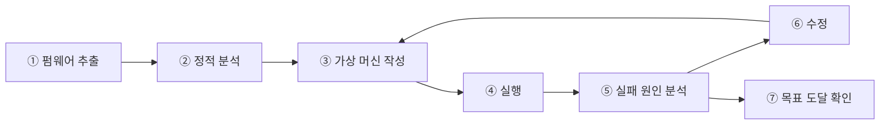
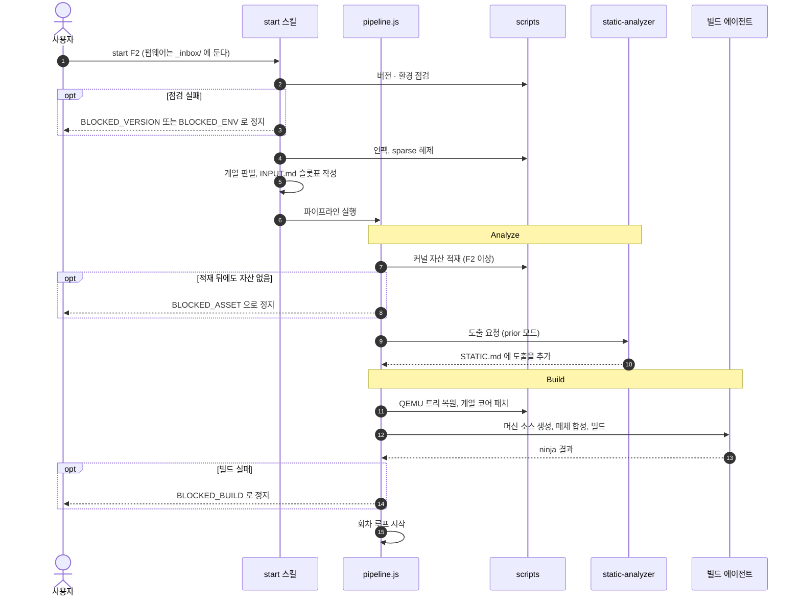
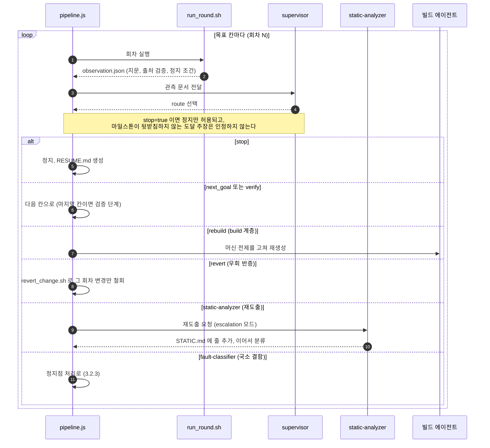
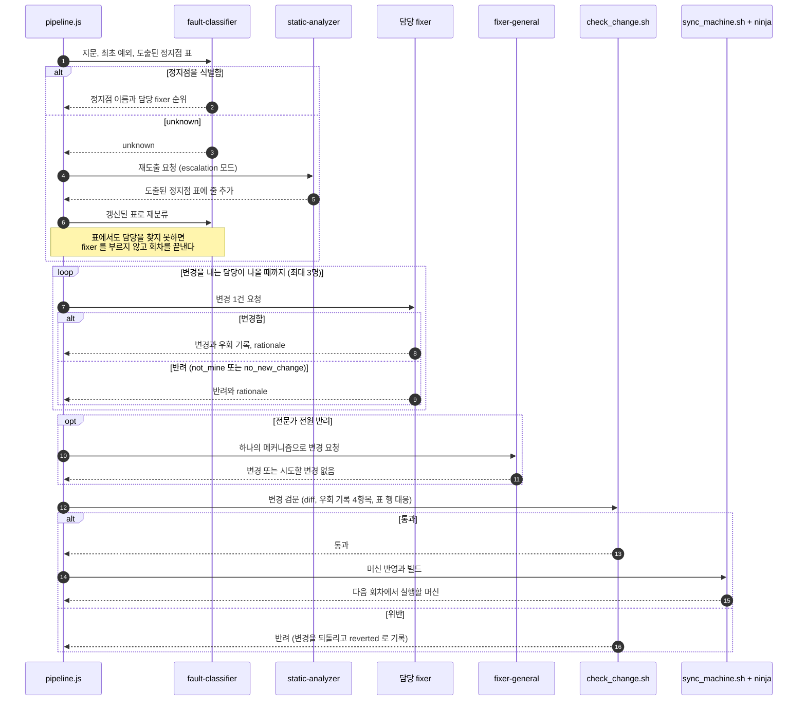
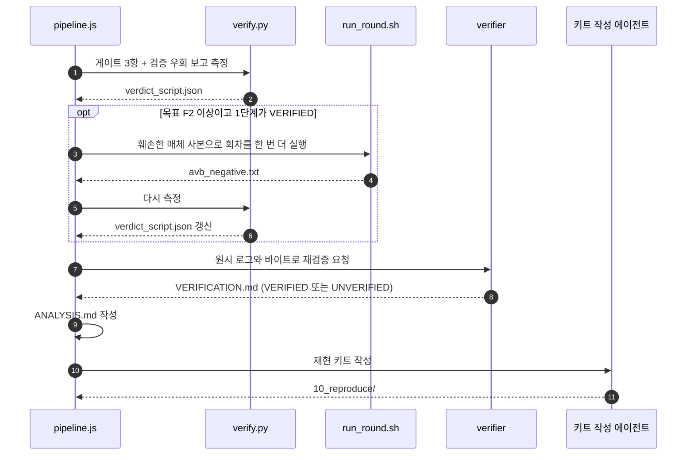

# AI 에이전트 기반 펌웨어 리호스팅: 에이전트 구조의 필요성

이 문서는 에이전트 구조를 왜 이렇게 나눴는지를 설명한다. 운영 규칙의 정본은 [CLAUDE.md](../CLAUDE.md),
파일별 목록은 [구성 요소](components.md) 다. 마지막 절 「설계 이력」은 초기 설계 초안에만 있던 근거를 옮겨 둔 것이다.

---

## 1. 배경: 리호스팅이란

- 실기기 없이 펌웨어를 **원본 바이너리 그대로** QEMU 위에서 실행하고, 펌웨어가 실제로 접근하는 하드웨어 환경만 만들어 준다
- 이 플러그인은 부트로더 첫 스테이지부터 커널이 rootfs 를 마운트할 때까지를 **하나의 연속 실행**으로 재현한다. 커널 이미지를 QEMU 에 직접 넘기지 않고(커널 이미지만 실행하는 기존 연구와의 차이), 다음 단계의 적재는 펌웨어 자신의 코드가 한다
- 자세한 내용은 [리호스팅 개요](onboarding/01-rehosting-overview.md) 에 있다

---

## 2. 사람의 수동 리호스팅 흐름

### 2.1 절차

| 단계 | 작업 내용 |
|---|---|
| ① 추출 | 펌웨어 패키지에서 부트로더·커널·파티션 이미지를 꺼낸다 |
| ② 정적 분석 | 디스어셈블러로 진입 주소, 적재 주소, 주변장치 주소, 부트 단계 경계를 파악한다 |
| ③ 머신 작성 | 분석 결과를 바탕으로 메모리 맵, CPU 설정, 주변장치 모델을 QEMU 머신 코드로 작성한다 |
| ④ 실행 | QEMU 로 실행하고 콘솔 출력과 실행 트레이스를 수집한다 |
| ⑤ 원인 분석 | 실행이 멈춘 지점의 예외 정보(ESR·FAR·ELR)와 로그를 읽고 원인을 추정한다 |
| ⑥ 수정 | 누락된 주변장치 모델 추가, 보안 호출 응답 추가 등 머신을 수정한다 |
| ⑦ 확인 | 목표 지점(부트로더 셸, 커널 배너 등)에 도달했는지 판단한다 |

- ④~⑥ 을 수십~수백 번 반복하는 것이 작업 시간의 대부분을 차지한다

### 2.2 수동 흐름의 한계

- **숙련 의존**: 예외 레지스터 해석, ARM 예외 레벨, 벤더 스토리지 컨트롤러 등 여러 영역의 전문 지식이 동시에 필요하다
- **반복 비용**: 한 번의 실행과 분석에 수십 분이 걸리고, 실행 트레이스가 한 번에 10 GB 이상 생성된다
- **확인 편향**: 사람도 "진전이 있었다"고 믿고 싶어 하며, 우연히 통과한 결과를 성공으로 받아들이기 쉽다
- **기록 누락**: 무엇을 왜 바꿨는지, 어떤 가설을 배제했는지가 남지 않아 재현과 인계가 어렵다

---

## 3. AI 에이전트를 활용한 흐름

### 3.1 기본 발상

- 수동 흐름의 ②·⑤·⑥·⑦ 은 **해석과 판단**이 필요한 작업이므로 LLM 에이전트가 맡는다
- ①·④ 와 측정값 계산은 **결정적인 작업**이므로 스크립트가 맡는다
- 원칙: **측정은 스크립트가, 해석과 제어는 에이전트가, 정지 판정의 입력값은 관측 사실이 맡는다**

### 3.2 흐름

흐름은 네 장으로 나눠 그린다. 준비(`start` 한 번), 회차 루프(목표 칸마다 반복), 정지점 처리(회차 루프가 분류로 넘긴 경우), 검증과 포장(마지막 칸에 도달한 뒤)이다. 그림의 참가자 가운데 `pipeline.js` · `run_round.sh` · `check_change.sh` 등 파일 이름은 스크립트이고, `supervisor` · `fault-classifier` · `static-analyzer` · fixer · `verifier` · 빌드 에이전트는 LLM 에이전트다.

#### 3.2.1 준비: 펌웨어 투입부터 첫 빌드까지

- 점검 · 언팩 · 자산 적재처럼 판단이 필요 없는 일은 스크립트가 한다. 계열 판별은 탐색 힌트와 자료 묶음을 고르는 일이고, 스테이지별 아키텍처는 판별이 아니라 도출한다. 판별 결과와 근거는 `INPUT.md` 에 적는다
- 도출은 `static-analyzer` 가 하고, 결과는 `STATIC.md` 에 덮어쓰지 않고 **추가**한다. 머신 생성 단계가 이 파일을 읽는다
- 머신 소스는 빌드 에이전트가 템플릿과 `STATIC.md` 의 도출값으로 생성한다. QEMU 트리 복원과 코어 패치는 에이전트에 맡기지 않고 스크립트가 먼저 적용한다. 패치가 앵커를 찾지 못하면 에이전트가 우회하지 않고 정지한다

#### 3.2.2 회차 루프: 측정과 라우팅

- **측정이 먼저다.** `run_round.sh` 가 실행 한 번을 관측 문서 하나(`observation.json`)로 만든다. 지문, 출력 출처 검증, 정지 조건(`stop_conditions.py`)이 모두 여기서 계산된다
- **supervisor 는 라우팅과 계층 판정을 맡는다.** 정지 조건이 서 있는데 계속을 지시하면 파이프라인이 강제로 정지하고 모순을 기록한다
- **원인이 머신 생성 전제(build 계층)에 있으면 회차로 고치지 않는다.** 진입 EL, 진입 PC, 적재 주소 같은 전제는 머신을 다시 만들어 바로잡는다

#### 3.2.3 정지점 처리: 분류, 수정, 검문

- **분류가 `unknown` 이면 추측하지 않고 static-analyzer 가 재도출한다.** 그 결과는 `STATIC.md` 의 「도출된 정지점」 표 한 줄로 남아야 분류기와 fixer 가 읽는다
- **fixer 를 부르는 순서는 supervisor 의 처방, 분류기의 순위, 도출표가 지목한 담당 순이다.** 담당이 틀렸을 수 있으므로 한 명이 반려해도 다음 후보에게 묻는다
- **회차당 변경은 1건이다.** fixer 의 변경은 `check_change.sh` 검문을 통과해야 빌드되고, 위반이면 되돌린다. 담당 전문가가 전부 반려했을 때만 `fixer-general` 이 하나의 일관된 메커니즘을 한 건으로 처리한다

#### 3.2.4 검증과 포장: 마지막 칸에 도달한 뒤

- **1단계는 스크립트의 측정, 2단계는 verifier 의 재검증이다.** 검증 우회가 있으면 판정 문구에 건수를 병기한다
- **음성 시험은 한 번 더 도는 회차다.** 매체 사본의 한 비트를 훼손해 검증이 실패하는지 본다. `negative_test: false` 로 끌 수 있고, 끄면 보고가 "펌웨어의 검증은 증명되지 않음"이라고 적는다

세부 흐름은 [CLAUDE.md](../CLAUDE.md) 5절과 [회차 루프와 정직성](onboarding/04-loop-and-honesty.md) 에 있다.

### 3.3 수동 흐름과의 대응

| 수동 단계 | 담당 |
|---|---|
| ① 추출, ④ 실행 | 스크립트 |
| ② 정적 분석 | 정적 분석 에이전트 |
| ⑤ 원인 분석 | 분류 에이전트 (필요 시 정적 분석 에이전트 재호출) |
| ⑥ 수정 | 수정 에이전트 |
| 반복 여부 판단 | 감독 에이전트 + 정지 조건 스크립트 |
| ⑦ 목표 도달 확인 | 도달은 실행 스크립트의 마일스톤 판정, 그 콘솔이 진짜인지는 검증 스크립트 + 검증 에이전트 |

---

## 4. 왜 에이전트 구조를 나눠야 했는가

단일 에이전트에게 "분석하고, 고치고, 성공 여부를 판단하라"고 맡기면 아래 문제가 발생합니다.
각 항목은 역할 분리로 대응한 구조적 원인입니다.

### 4.1 진단과 수정이 같으면 거짓 원인 생성

- **문제**: 수정 권한을 가진 에이전트는 "고칠 것이 있어야 한다"는 압력을 받는다
  - 원인을 모를 때도 그럴듯한 원인을 지목하고 수정을 시도한다
  - 근거 없는 수정이 펌웨어를 실기기라면 가지 않았을 분기로 보낸다
- **분리**: 분류 에이전트는 **수정 권한이 없고**, "미상"을 정답으로 허용한다
  - 고칠 대상이 없으니 원인을 만들어 낼 동기가 없다
  - "미상"이면 추측 수정 대신 정적 분석을 다시 요청한다
- **근거**: 194회 중 24회(12.4%)가 "미상"으로 판정되었다(측정: [백로그](backlog.md) 「측정 근거」). 원인을 모르는 상황이 전체의 1할을 넘으며, 분리 구조는 이 구간을 추측 수정 대신 재분석으로 보냈다

### 4.2 수정한 쪽이 성공을 판정하면 거짓 성공이 생긴다

- **문제**: 에이전트가 만든 머신이 스스로 목표 문자열을 출력하거나 입력 버퍼를 채우면, 로그상으로는 부팅이 성공한 것처럼 보인다
  - 머신 코드가 부트로더 프롬프트를 출력 → "셸 도달"로 오인
  - 머신이 자기 수신 버퍼를 채움 → "명령 응답"으로 오인
  - 핸들러를 강제로 호출 → 입력에서 명령 처리기로 가는 실제 경로 없이 출력만 발생
- **분리**: 성공 판정을 **수정 에이전트와 독립된 검증 단계**가 맡는다
  - 1차: 스크립트가 머신 소스가 내는 문자열이 콘솔에 없는지, 콘솔의 고정 문자열이 펌웨어 이미지 안에 실제로 있는지, 머신이 자기 수신 버퍼를 채우지 않는지 측정
  - 2차: 검증 에이전트가 원시 로그와 바이트를 재검증. 판정을 낮추는 것은 자유롭지만, 높이려면 바이트 수준 증거가 필요하다
- **요지**: 거짓 성공은 기술적 실패보다 위험하다. 논문의 결과 자체를 무효로 만들기 때문이다

### 4.3 정지 판단을 에이전트에게 맡기면 편향된다

- **문제**: LLM 은 두 방향으로 편향된다
  - "한 번만 더 하면 된다"며 이미 소진된 경로를 계속 반복
  - 반대로 어려워 보이면 근거 없이 "불가능"을 선언하고 조기 정지
- **분리**: 정지 여부는 **스크립트가 관측값으로 계산**하고, 감독 에이전트는 그 판정을 뒤집을 수 없다
  - 정지 조건은 세 가지가 동시에 성립할 때만 인정한다
    1. 최근 3회 동안 실행 결과가 변하지 않거나 두 상태를 오간다
    2. 정적 분석 재수행에서 새로 기록된 사실이 0건이다 (자기 신고가 아니라 문서에 늘어난 줄 수로 측정)
    3. 질의한 수정 에이전트 전원이 "더 시도할 변경 없음"으로 답했다 (지문을 움직이지 못한 변경은 시도로 세지 않으므로, 그런 변경이 기본 6건 쌓여도 이 조건이 선 것으로 본다)
  - 반복 횟수와 소요 시간은 정지 사유가 아니다
- **근거**: 감독 에이전트가 정지 판정에 반하여 계속을 지시하면 파이프라인이 강제로 정지하고 모순을 기록한다
- 이 결정의 비용 근거는 「설계 이력」의 6.1 에 있다

### 4.4 분석과 수정이 섞이면 근거 없는 값이 머신에 들어간다

- **문제**: 수정하면서 분석하면, 확인되지 않은 주소나 다른 기기에서 본 값을 "일단 넣어 보는" 일이 생긴다
- **분리**: 정적 분석 에이전트만 사실을 도출하고, **근거가 없으면 "미확정"으로 남긴다**
  - 모든 주소·구조·바이트열은 디스어셈블 또는 실행 관찰로 도출한다
  - 수정 에이전트는 분석 문서에 기록된 사실만 사용한다
- **요지**: 분석 결과는 대화 응답이 아니라 **문서**로 전달된다. 응답에만 있는 사실은 다음 에이전트에게 전달되지 않고, 근거 없는 기록은 수정 방향을 잘못 이끈다

### 4.5 컨텍스트와 전문 지식의 한계

- **문제**: 실행 한 번의 트레이스는 10 GB 이상이고, 필요한 지식은 메모리 맵·보안 모니터·스토리지 컨트롤러·커널 보안 기능 등으로 넓다. 하나의 에이전트 컨텍스트에 모두 담을 수 없다
- **분리**:
  - 원시 데이터는 스크립트가 걸러 필요한 정보(최초 예외, 예외 수, 도달 지점)만 남긴다 (10 GB → 수 MB)
  - 각 에이전트는 자기 역할에 필요한 입력만 받는다
  - 새 실패 유형은 분류표에 한 줄이고, 계열 전용 표와 진행 가이드는 프로필의 한 줄로 연결된다. 프롬프트 전체를 고치지 않는다
  - 새 수정 영역은 먼저 기존 수정 에이전트의 담당(`fixers/registry.yaml` 의 `handles`)을 늘려 처리할 수 있는지 본다. 그것이면 `registry.yaml` 만 고친다. 새 수정 에이전트는 파일 하나로 끝나지 않는다: `workflows/pipeline.js` 의 `KNOWN_FIXERS` 와 `tests/smoke.sh` 의 해당 단언도 함께 고쳐야 한다

### 4.6 요약

| 분리하지 않을 때의 문제 | 대응한 분리 |
|---|---|
| 고칠 대상을 만들려고 원인을 지어낸다 | 분류(수정 권한 없음)와 수정 분리 |
| 머신이 만든 출력을 성공으로 센다 | 수정과 검증 분리 |
| 계속/정지를 편향되게 판단한다 | 정지 판정은 스크립트, 감독은 뒤집지 못함 |
| 설계 전제 오류를 증상 처치로 덮는다 | 감독이 "반복 수정 vs 머신 재생성" 판단 |
| 근거 없는 값이 머신에 들어간다 | 분석(도출 전담)과 수정 분리 |
| 컨텍스트 초과, 지식 희석 | 스크립트 전처리 + 역할별 입력 제한 |

---

## 5. 각 에이전트의 역할

에이전트 목록, 파일 이름, 소스 수정 권한은 [구성 요소](components.md) 2절이 정본이다. 여기에는 각 역할을 왜 따로 두었는지만 적는다.

### 5.1 정적 분석 에이전트 (`static-analyzer`)

- 사실을 도출하는 쪽이 수정 권한을 가지지 않아야, 근거가 없는 값이 "일단" 머신에 들어가지 않는다. 근거가 없으면 "미확정"으로 남긴다
- 기록은 `STATIC.md` 에 덮어쓰지 않고 추가한다. 응답에만 있는 사실은 다른 에이전트에게 전달되지 않기 때문이다
- 루프 전 한 번(사전 도출), 분류가 unknown 이거나 실행이 정체될 때(재도출) 호출된다

### 5.2 감독 에이전트 (`supervisor`)

- 스크립트로 정할 수 없는 판단이 하나 남는다: **이 실패가 회차 수정으로 풀리는가, 머신 설계 전제가 틀렸는가.** 이 판단만 맡기고 분석과 수정은 하지 않는다
- 정지 판정은 측정값이라 감독이 뒤집지 못한다. 반복 횟수와 소요 시간을 이유로 정지하지도 않는다

### 5.3 분류 에이전트 (`fault-classifier`)

- 고칠 대상이 없으니 원인을 지어낼 동기가 없고, 그래서 "미상"(`unknown`)이 올바른 답이 될 수 있다
- 마지막 예외가 아니라 **최초 예외**를 원인으로 본다. 예외 처리기가 다시 폴트하면 주소가 반복마다 바뀌어 원인이 아닌 위치를 가리키기 때문이다

### 5.4 수정 에이전트 (`fixer-*`)

- 수정 권한을 한 곳에 모아야 무엇을 누가 왜 바꿨는지 추적된다. 한 번에 한 건만 바꾸는 것도 같은 이유다: 묶으면 어느 변경이 효과를 냈는지 알 수 없다
- 실기기와 다르게 만든 부분은 전부 우회로 기록한다. 부작용 항목은 이후 실행이 정체될 때 가장 먼저 참조된다
- 담당 전문가가 전부 반려한 정지점은 `fixer-general` 이 맡는다. 담당이 없는 정지점은 전문가들이 나눠 놓은 영역에 걸치는 일이 많기 때문이다. 범위가 넓은 대신 지문을 움직이지 못한 변경은 시도로 세지 않는다

### 5.5 검증 에이전트 (`verifier`)

- 머신을 만든 쪽이 성공을 판정하면 머신이 낸 출력이 성공으로 읽힌다. 그래서 측정(`verify.py`)과 재검증(`verifier`)을 수정 쪽과 분리했다
- 판정은 비대칭이다: 낮추는 것은 자유롭고, 높이려면 바이트 수준 증거가 필요하다

### 5.6 스크립트 (에이전트가 아닌 구성 요소)

- 에이전트가 판단에 쓰는 **입력값**을 결정적으로 계산한다: 실행, 예외 정보 추출, 출력 출처 검증, 정지 조건 계산, 변경 검사, 기록
- 에이전트가 측정값을 재해석하거나 고쳐 쓰지 못하도록, 측정은 전부 스크립트가 맡는다

### 5.7 한눈에 보기

| 구성 요소 | 하는 일 | 소스 수정 | 분리한 이유 |
|---|---|---|---|
| 정적 분석 에이전트 | 사실 도출, 근거 없으면 "미확정" | 불가 | 근거 없는 값이 머신에 들어가는 것을 차단 |
| 감독 에이전트 | 다음 행동 결정, 설계 전제 오류 판단 | 불가 | 국소 수정으로 해결되지 않는 문제를 식별 |
| 분류 에이전트 | 실패 유형 판정, 모르면 "미상" | 불가 | 원인 날조 동기 제거 |
| 수정 에이전트 | 회차당 변경 1건, 우회 기록 | **가능** | 수정 권한을 한 곳에 집중해 책임 추적 |
| 검증 에이전트 | 출처 기반 최종 판정 | 불가 | 거짓 성공 차단 |
| 스크립트 | 실행·측정·정지 판정 | 해당 없음 | 에이전트 편향이 측정값에 들어가는 것을 차단 |

---

## 6. 설계 이력

지금 구조는 2026년 7월의 설계 초안 세 편(`_design/REDESIGN.md`, `_design/architecture.md`, `_design/redesign_final.md`)에서
나왔다. 초안은 추적하지 않는 작업 문서였고 명세로서는 폐기됐다 (옛 이름, 옛 판정 체계, 트랙 구분, 옛 명령).
아래는 초안에만 있던 **근거**다. 괄호의 줄 번호는 삭제 직전 초안 기준이며, 초안은 git 에 남지 않았다.

### 6.1 정지 권한은 LLM 에게 두지 않는다

정지 조건은 세어 보면 나오는 것이라 해석할 자리가 없고, 없는 해석 자리에 LLM 을 넣으면 해석을 지어낸다.
여러 회차의 실패를 지켜본 LLM 이 가장 큰 매몰비용 압력을 받는다는 점도 있다. 오류 비용도 비대칭이다:
잘못 멈추면 재개하면 되지만(싸다), 멈추지 않으면 회차가 그대로 소모된다(되돌릴 수 없다). (_design/REDESIGN.md 68-71)
이후 제어자는 LLM(지금의 `supervisor`)으로 정해졌지만, 정지의 입력값은 사실로 두고 사실과 반대로 계속을 지시하면
파이프라인이 강제로 정지하게 했다. (_design/redesign_final.md 13, 130-134)

### 6.2 분류는 `unknown` 이라고 답할 수 있는 LLM 이 한다

스크립트 분류는 자신 있게 틀린다. 새 SoC 에서 처음 보는 폴트가 겉보기에 기존 클래스와 닮으면 확신을 갖고
잘못 라우팅하고, 새로운 폴트라는 사실이 묻힌다. 그래서 분류는 LLM 이 하고 `unknown` 을 정상 답으로 두며,
모르는 것은 추측이 아니라 정적 분석의 도출로 보낸다. (_design/REDESIGN.md 422-424)

### 6.3 루프를 움직이는 것은 매 회차 출처 검사이고, 최종 검증은 보고다

매 회차의 출처 검사는 "이 줄을 펌웨어가 찍었나, 우리 머신이 찍었나"를 싸게 확인해 지문을 믿을 수 있게 만들고,
그 지문이 루프 제어에 쓰인다. 종료 시 한 번 하는 최종 검증은 비싸고 보고에 쓰인다. 계속할지를 정하는 것은
출처 검사이지 최종 검증이 아니며, 최종 검증은 목표 도달 전에는 통과할 수도 없다. (_design/REDESIGN.md 381-390)

### 6.4 지문은 분류 이름이 아니라 원시 숫자다

LLM 은 같은 문제를 회차마다 다른 이름으로 부를 수 있다. 분류 이름으로 진전을 재면 정체를 영영 감지하지 못한다.
숫자는 흔들리지 않는다. (_design/architecture.md 127-128)

### 6.5 fixer 가 직접 고치고, diff 를 세는 검문이 막는다

처방을 JSON 으로 받아 C 코드를 고치는 적용 스크립트는 만들기 어렵고 잘 깨진다. fixer 를 읽기 전용으로 묶는 대신
직접 고치게 하고, 그 변경을 diff 로 세는 검문(지금의 `check_change.sh`)을 통과해야 빌드되게 했다. 프롬프트로
부탁하는 것보다, 또 JSON 을 믿는 것보다 확실하고 만들기도 쉽다. (_design/architecture.md 440-442, 196-197)

### 6.6 FirmCure 와의 대조

IoT 리호스팅 연구 FirmCure 의 구조와 비교해 가져온 것과 가져오지 않은 것이다. (_design/REDESIGN.md 518-540)

| 가져온 것 | 우리 쪽 대응 |
|---|---|
| Manager 는 읽기 전용 (진단과 수리 분리) | 분류와 수정의 분리 |
| Manager 에서 Diagnosis 로 에스컬레이션 | 분류가 `unknown` 이면 정적 분석이 도출한다 |
| 한 번에 수정 하나, 수리 이력 기억 | 회차당 변경 1건, 기계가 읽는 회차 이력 |
| 상한과 순환 진동 차단 | 정지 조건 |
| 자기 보고를 믿지 않는 검증 게이트 | 매 회차 출처 검사와 종료 시 검증의 두 층 |
| 억제 목록 (되돌릴 경로) | 정체 시 우회 기록의 부작용을 먼저 의심 |
| 지식 재사용 | `knowledge/` 에 반영하되 값은 금지, 절차만 |

| 가져오지 않은 것 | 이유 |
|---|---|
| 계층별 전문가 4종 (Crash · File · Web · Generic) | 그쪽의 폴트 공간은 넓고 얕아 계층별로 나뉜다. 우리 쪽은 좁고 깊어서 전부 "하드웨어 모델 미완"이라는 한 인과 사슬이라 계층으로 나눌 수 없다 |
| Generic 폴백 전문가 | 리눅스 사용자 공간에서는 틀린 추측이 바로 드러나지만, 우리 쪽에서는 틀린 추측이 그럴듯하게 부팅되는 가짜를 만든다. 이 판단은 뒤에 `fixer-general` 로 뒤집혔다 (6.8) |
| LLM Manager 에게 종료 판단 | 그쪽도 종료를 Manager 에게 맡기지 않고 상한으로 끊는다. 우리는 종료가 핵심 요구라 결정론으로 계산한다 |
| 계층형 위임 | 초안 당시 LLM 은 셋이었고 폴트 공간이 좁아 계층은 오버헤드였다 |
| 바이너리 패치 회피 (GDB 중단점 연쇄) | 취지는 옳지만, 우리는 패치 전 원본 바이트 확인으로 같은 성질을 얻는다 |

### 6.7 옛 이름과 현재 이름

| 초안의 이름 | 현재 |
|---|---|
| Analyst | `static-analyzer` |
| Manage | `supervisor` |
| Diagnosis · Triager · Classifier | `fault-classifier` |
| Fixer × N | `agents/fixer-*.md` (등록은 `fixers/registry.yaml`, 초안의 `_registry.yaml`) |
| Verify(2차) | `verifier` |
| Verify(1차) · Verifier(스크립트) | `scripts/verify.py` |
| Driver · Orchestrator | `workflows/pipeline.js` (정지 계산은 `scripts/stop_conditions.py`) |
| Run · Runner · Observer | `scripts/run_round.sh`, `scripts/run_full.sh` |
| Builder 의 검문 | `scripts/check_change.sh` + `scripts/sync_machine.sh` + ninja |
| Builder 의 생성 | 파이프라인의 Build 단계 (QEMU 트리 복원, 코어 패치, 머신 소스, 매체 합성, ninja) |
| `stop_guard.py` | `scripts/stop_conditions.py` |
| `moves_exhausted` | 정지 코드 `EXHAUSTED` |
| `history.jsonl` | `rounds.jsonl` |

### 6.8 만들지 않았거나 뒤집힌 것

- **처방과 적용의 분리(Prescriber · Applier)는 만들지 않았다.** fixer 가 직접 고치고 `check_change.sh` 가 검문한다 (6.5)
- **"만능 fixer 는 두지 않는다"는 판단은 뒤집혔다.** 모든 정지점에 담당이 있지 않아서, 전문가가 전부 반려했을 때만 도달하는 `fixer-general` 을 두었다. 범위는 넓히되 우회 기록 검사는 전문가와 똑같이 묶는다
- **"fixer 추가는 파일 하나와 등록 몇 줄"이라는 예상은 맞지 않았다.** 파이프라인이 부르는 fixer 목록은 `KNOWN_FIXERS` 에 하드코딩되어 있다 (4.5)
- fixer 가 진전 마커를 선언하고 관측되면 정체를 리셋하는 규칙(REDESIGN.md 219-220, 372-379)은 만들지 않았다. 정체는 지문, 마일스톤, 채널 깊이의 관측 변화로만 풀린다
- 「담당 아님」 반려 뒤 재분류 1회, 그다음 정적 분석으로 간다는 초안 규칙(architecture.md 416, redesign_final.md 171)도 바뀌었다. 지금은 같은 회차에서 순위의 다음 후보에게 넘기고, 전원이 반려하면 fixer-general 로 간다
- 초안의 마이그레이션 계획은 실행됐고, 그 경과는 [CHANGELOG.md](../CHANGELOG.md) 에 있다

---

## 관련 문서

- [README.md](../README.md)
- [온보딩 문서](onboarding/README.md)
- [구성 요소](components.md)
- [백로그](backlog.md)
- [CHANGELOG.md](../CHANGELOG.md)
