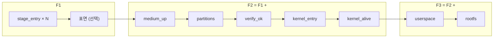

# 01. 리호스팅 개요

## 1. 리호스팅이란

기기 없이 펌웨어를 **원본 바이너리 그대로** 실행시키는 것. 펌웨어 코드는 손대지 않고
그 코드가 접근하는 **환경**을 만든다.

| | 에뮬레이션 | 리호스팅 |
|---|---|---|
| 대상 | 하드웨어 전체 | 펌웨어가 실제로 접근하는 부분만 |
| 목표 | 정확한 재현 | 코드가 계속 실행되게 하는 것 |
| 미모델 주변장치 | 구현 필요 | 접근 시점에 관찰 후 모델링. DTB 의 블록을 한꺼번에 열 때도 **첫 접근을 기록**해 무엇이 실제로 쓰였는지를 잃지 않는다 |

---

## 2. 부팅 순서와 실행 범위

| # | 단계 | 이 저장소에서 |
|---|---|---|
| ① | BootROM | 실행 안 함. **남기는 상태만** 모델링 |
| ② | 1차 부트로더 | 평문이면 **실제 실행**. 암호화면 건너뛰고 기록 |
| ③ | 부트로더 (S-Boot / LK / aboot) | **실제 실행** |
| ④ | EL3 모니터 | SMC shim 으로 모델링. 체인에 모니터 이미지(BL31 등)가 있으면 **그것을 실제 실행**하고 shim 은 쓰지 않는다 |
| ⑤ | EL2 하이퍼바이저 | 커널 소관. 가로채지 않음 |
| ⑥ | 커널 | **실제 실행.** 부트로더가 적재한다 |
| ⑦ | init 1단계 + 스토리지 | **실제 실행** |
| ⑧ | init 2단계 | 미해결 (`/data` FBE → TEE) |
| ⑨ | Android UI | 범위 밖 |

연속 실행의 전체 그림은 [README](../../README.md) 첫머리에 있다.

- `-kernel Image` · `-dtb` · `-initrd` 를 쓰지 않는다
- 암호화되었거나 없는 스테이지는 **다음 실행 가능 스테이지로 진입을 재지정**한다
- 건너뛰기 조건: 이후 스테이지가 건너뛴 스테이지의 메모리를 읽지 않아야 한다
- **대신할 값을 지어내지 않는다.** 요구되면 채울 대상이 아니라 보고할 사실이다

### ARM Exception Level

| EL | 리호스팅에서의 의미 |
|---|---|
| EL3 | 부트로더가 `smc` 로 요청한다. shim 으로 응답 |
| EL2 | `kvm-arm.mode=protected` 면 커널이 쓴다. 가로채면 안 된다 |
| EL1 | OS 커널 |
| EL0 | 유저스페이스 |

잘못된 EL 로 진입시키면 증상이 엉뚱한 곳에서 나타난다 → [04](04-loop-and-honesty.md)

---

## 3. 목표 단계와 등급

`[<표면>]` 은 선택 칸이다. 입력 없이 커널까지 가는 부트로더는 사다리에서 표면을 빼고 `autoboot` 로 기록한다.

| 등급 | 범위 |
|---|---|
| **F1** | 스테이지 진입 전부 + 표면 (있으면) |
| **F2** | F1 + 매체·파티션·검증·커널 진입·**커널 실행** |
| **F3** | F2 + userspace·rootfs |

- **`kernel_entry` ≠ `kernel_alive`.** 앞은 부트로더가 자기 커널 점프 줄(도출값)을 출력,
  뒤는 **커널만 낼 수 있는 줄이 어느 채널에서든 관측**된 것 (배너 `Linux version` 이 우선, 대체
  토큰이면 "배너 미관측"을 기록). UART 가 아니라 게스트 RAM 의 커널 로그를 호스트가 읽는
  메모리 덤프 채널로 보는 펌웨어도 있다
- 점프 선언만으로 도달을 세면 **커널이 실행되지 않은 실행을 완주로 보고**하게 된다
- **커널이 조용하면 커맨드라인부터 본다.** `console=ram` 이면 로그가 RAM 버퍼로 간다. 침묵은
  실패의 증거가 아니다
- 도달 서술은 칸 상태(`reached` · `reached_bypassed` · `not_reached`)를 그대로 쓴다. 검증을
  우회한 채 닿았으면 "F2 도달"이 아니라 **"F2 (verify_ok 우회 N건)"** 이다
- **F1 은 스토리지 모델 없이 도달 가능하다.** F1 을 확정한 뒤 F2 로 간다

---

## 4. 무엇이 어려운가

| 유형 | 증상 | 담당 |
|---|---|---|
| 주변장치 부재 | data abort, 또는 무한 폴링 | `fixer-memory` |
| 보안 환경 부재 | `smc` → undefined instruction | `fixer-el3` |
| 이전 단계 부재 | 앞 단계의 함수 포인터 호출 | `fixer-bootflow` |
| 무결성 검사 | 서명 검증 실패 | `fixer-secureboot` |
| 스토리지 컨트롤러 | 문서 없는 레지스터 폴링 | `fixer-storage` |
| 커널 보안 게이트 | FIPS·DEFEX·SELinux panic | `fixer-kernel` |

### 허위 통과

| 수법 | 왜 허위인가 |
|---|---|
| 적응형 토글 | 잘못된 분기로 보내며 다른 펌웨어에서 재현되지 않는다 |
| 머신이 프롬프트 문자열을 출력 | 우리가 출력한 것이다 |
| 머신이 자기 수신 버퍼를 채움 | 자기 자신과 대화한 것이다 |
| 트램폴린으로 핸들러 강제 호출 | 입력에서 디스패처로 가는 경로가 없다 |
| 서명 검증을 패치로 무력화 | 검증을 거쳤다는 주장이 성립하지 않는다. **예외는 해시를 하드웨어 엔진이 계산하는 펌웨어 하나뿐**이고, 엔진 모델링이 먼저이며 우회하면 라벨과 건수를 병기한다 |

---

## 5. 왜 이 지점이 중요한가

| 도달 지점 | 가능해지는 것 |
|---|---|
| 부트로더 표면 | 명령 파서에 입력을 넣어 시험 |
| 스테이지 연속 실행 | 각 단계가 다음에 무엇을 넘기는지 관찰 |
| 서명 검증 통과 | 검증 코드가 실제로 수행됐음을 양방향으로 증명 |
| 커널 진입 | 부트로더의 부팅 결정 로직을 끝까지 추적 |
| rootfs 마운트 | 벤더 스토리지 컨트롤러 사양을 복원했다는 증명 |

- 부트로더·커널 초기화 구간은 실기기에 디버거가 붙지 않는다
- 부트 파티션을 잘못 건드리면 실기기는 복구 불가가 된다
- 부트로더는 커널보다 먼저, 더 높은 권한으로 실행된다
- 재현 키트로 빌드 없이 같은 상태를 재현한다

---

## 다음

| 문서 | 내용 |
|---|---|
| [02](02-unified-chain.md) | 통합 체인 실행 |
| [03](03-boot-medium.md) | 부팅 매체와 스토리지 |
| [04](04-loop-and-honesty.md) | 회차 루프와 정직성 |
| [05](05-plugin-check.md) | 설치·버전 확인 |
