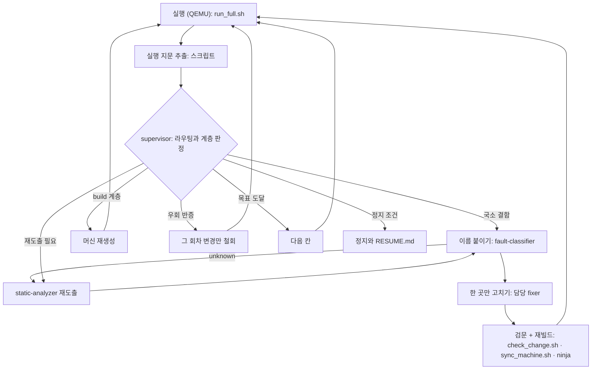
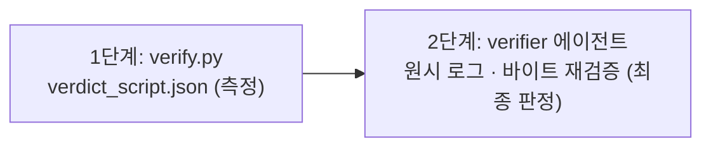

# 04. 회차 루프와 정직성

## 1. 루프



호출 순서까지 보려면 [설계 근거 3.2](../design-rationale.md#32-흐름)를 본다.

측정과 정지 판정은 스크립트가, 해석과 수정은 에이전트가 맡는다. 이 분리가 없으면
"고칠 것이 있어야 하니까" 없는 원인을 지목하게 된다.

- 전문가가 전부 반려했을 때만 가는 `fixer-general` 의 변경도 검문(`check_change.sh`)을 통과해야 센다.
  위반이면 되돌리고 `reverted` 로 기록한다
- 다만 범위가 다르다. 모든 정지점에 담당 fixer 가 있지 않으므로 `fixer-general` 은 하나의 일관된 메커니즘이 여러 곳 ·
  여러 파일에 걸쳐도 한 회차에 고친다. 파이프라인이 그에게만 `CHANGE_SCOPE=general` 을 주고, 그 범위에서 검문은
  소스 파일 하나 검사와 `MAX_HUNKS`(기본 3) 검사만 건너뛴다. 우회 기록 검사(4항목 · 쓸 수 있는 기록 · 패치 표 행 대응 ·
  `hash_engine` 행)는 전문가와 같다
- 모든 fixer 가 공유하는 규칙은 `workflows/pipeline.js` 의 `FIXER_RULES` 하나에 있고 모든 fixer 프롬프트에 붙는다.
  열린 질문은 `no_new_change=true` 와 `rationale` 로 답하고, 그 `rationale` 은 다음 도출의 초점으로 간다

---

## 2. 실행 지문

```
(최초 예외의 ESR/FAR/ELR, 마일스톤, 콘솔 바이트, 콘솔 고유 줄 수, 예외 수 자릿수)
```

### 왜 최초 예외인가

- 예외 핸들러가 컨텍스트를 저장하다 다시 폴트하면 abort 가 중첩된다
- FAR 이 반복마다 `0x20` 씩 증가하다 타임아웃이 끊은 지점에서 멈춘다
- **마지막 FAR 은 재귀의 위치이지 원인이 아니며, 회차마다 값이 달라진다**

그 값을 지문에 쓰면 둘이 동시에 망가진다.

- 분류기가 실재하지 않는 정지점을 지목한다
- 정체 카운트가 영원히 0 이 되어 소진·재도출·계층 재검토가 발화하지 않는다

원인은 `fingerprint.json` 의 `origin` 에 있다. 예외 수는 자릿수로 비교한다.

### 트레이스는 걸러서 남긴다

- `-d int,in_asm,nochain` 은 폴트 루프에서 **회차당 10~12 GB** 를 쓴다. 15회차가 281 GB
  디스크를 채우고 WSL 이 재시작된 적이 있다
- 정작 읽는 것은 넷뿐이다: 예외 개수, **최초 예외 블록**, 마지막 FAR/ELR,
  스테이지 진입 PC 의 등장 순서
- `trace_filter.py` 가 QEMU 와 로그 파일 사이에서 그 넷만 남긴다. 스트리밍이라 실행이
  길어져도 메모리는 일정하다
- 예외 개수는 잘린 로그가 아니라 **필터가 원본 전체를 센 값**이다
- 입력이 없으면 **빈 파일**을 쓴다. "트레이스·콘솔 0바이트"가 QEMU 가 실행되지 않았다는
  신호이므로, 여기에 안내 줄을 쓰면 환경 실패가 펌웨어 판정으로 둔갑한다
- 회차 시작 전에 디스크 여유를 확인하고, 부족하면 회차를 시작하지 않는다
  (`MIN_FREE_MB`, 기본 4 GB). 지난 트레이스는 최근 것만 남긴다 (`TRACE_KEEP`, 기본 10)

### 부팅 깊이

- 마일스톤이 비어 있어도 실행이 전진할 수 있다. **콘솔 고유 줄 수**가 그 깊이를 센다
- 재시도 루프가 같은 줄로 수백 KB 를 내므로 바이트 수는 지표가 못 된다
- `timeout_bound=true` 는 한계가 펌웨어가 아니라 실행 시간이라는 뜻. fixer 를 배정하지 않는다
- 메모리 덤프 채널이 켜져 있으면 **커널 채널의 깊이**(마지막 커널 시각, 커널 고유 줄 수)도 지문에
  들어가고, **정체는 채널별로 계산한다.** UART 가 고정이어도 커널 로그가 전진하면 정체가 아니다
- 점프 직후의 침묵과 **게스트 리셋**은 다르다. 호스트 줄의 리셋·워치독 접근이 점프 직후에 관측되면
  `guest_reset_signal` 이 서고 정지점 이름 후보 `guest_reset_after_jump` 로 분류기에 간다 (원인은 가설)
- 예외 수가 임계를 넘으면 실행을 일찍 끝내는 `MAX_EXCEPTIONS` 는 **기본으로 꺼져 있다**

### 실행되지 않은 회차는 회차가 아니다

- QEMU 가 시작조차 못 하면 지문이 전부 0 으로 안정되고, 이는 정체로 읽힌다
- 종료코드와 트레이스·콘솔 0바이트를 검사해 `BLOCKED_ENV` 로 정지시킨다
- **콘솔이 나온 뒤의 비정상 종료는 머신 결함이다.** `qemu_abort` 로 fixer 에 배정한다

---

## 3. 계층

fixer 는 **이미 있는 머신 소스의 한 곳**을 고친다 (`fixer-general` 은 한 메커니즘이 걸친 여러 곳). 머신이
**무엇을 전제로 생성됐는지**는 고치지 못한다.

| 계층 | 예 | 고치는 주체 |
|---|---|---|
| loop | 미매핑 메모리 영역, 미처리 SMC id, 끝나지 않는 폴링 | fixer (회차당 1건) |
| build | 진입 EL, 진입 PC, 적재 주소, 메모리 골격, CPU 타입, 건너뛰기 재지정 | 머신 재생성 |

- 전제가 틀리면 fixer 는 증상만 처치한다
- **한 정지점으로 수십 회차를 소모하는 상황이 이렇게 생긴다**
- 효과 없는 변경이 임계를 넘으면 supervisor 가 머신 소스와 `stage_map.json` 을 읽어 판정한다

---

## 4. 정지 판정

**회차 수와 소요 시간은 정지 사유가 아니다.**

### 시도 소진: 셋이 동시에 성립할 때만

```
(지문 정체 또는 A↔B 진동)
AND static-analyzer 재도출에서 새 사실 0
AND 담당 fixer 전원이 "시도할 변경 없음"
```

- 정체는 **최근 창(기본 3회차)** 으로 판정한다. 한 회차의 일시적 변화가 수십 회차의
  정체를 지우면 소진은 영원히 성립하지 않는다
- "새 사실 0" 은 자기 신고가 아니라 **도출표에 늘어난 줄을 센 값**이다
- "fixer 소진" 도 **실제로 질의한 답변**이어야 한다

### 에이전트가 뒤집을 수 없다

`stop=true` 인데 supervisor 가 계속을 지시하면 파이프라인이 강제 정지하고 모순을 기록한다.

### `RESUME.md`

- 도달 지점과 근거 로그 경로
- 마지막 지문과 왜 거기서 멈췄는지
- **시도한 변경 전부와 각각이 지문을 움직였는지**
- 아직 안 써본 수단 · 재개 명령

---

## 5. 정직성 규칙

| # | 규칙 | 집행 |
|---|---|---|
| 1 | 추측 스텁 금지 (특히 적응형 토글) | 분류기가 `unknown` 이면 재도출 |
| 2 | 우회는 우회로 표기 | `check_change.sh` |
| 3 | 모든 주소·구조·바이트열은 분석으로 도출 | `static-analyzer` |
| 4 | 하드코딩을 분석처럼 표기하지 않는다 | 문서 검토 |
| 5 | 도달하지 못한 지점은 그렇게 기록 | `verify.py` |
| 6 | 성공 판정은 실행 증거로만 | `verify.py` + verifier |
| 7 | 머신 내부에서 입력을 만들지 않는다 | 출력 출처 검증 (매 회차) |

- **규칙 1**: "12회 읽은 뒤 값을 바꾼다" 같은 응답은 기기에서라면 가지 않았을 분기로
  보내며 다른 펌웨어에서 재현되지 않는다. **상수 응답만 허용한다**
- **규칙 7**: 콘솔에 목표 문자열이 나와도 머신 소스에 같은 문자열이 있으면 **우리가
  출력한 것**이다. 매 회차 자동 검사해 그 마일스톤을 무효화한다

### 우회 기록 (`06_machine/bypasses.md`)

| 항목 | 내용 |
|---|---|
| 대상 | 무엇을 바꿨는가 |
| 이유 | 이 환경에서 왜 원본대로 동작하지 않는가 |
| 방법 | 어떻게 바꿨는가 (주소·인코딩 포함) |
| 부작용 | 이제 무엇이 검증되지 않는가 |

**부작용 항목은 정체 시 가장 먼저 참조된다.** 형식적으로 채우면 쓸모가 없다.

- **부작용이 비어 있거나 `(기록 없음)` 이면 무효**이고 `check_change.sh` 가 반려한다
- 우회 1건 = 기록 1건. 패치 표 행에 `/* bypass:<id> */` 를 달아 기록 제목의 `#<id>` 와 일대일로 맞춘다
- 선택 항목 `- 메타: 종류=P; 표지=F; 출처=A; 도출=semi` 을 더할 수 있다. 표지 `F`(검증 위조·무력화)가
  붙은 우회가 **검증 우회**이며, 아래 검증 우회 보고의 입력이다

---

## 6. 검증



| 방향 | 규칙 |
|---|---|
| 낮추기 (VERIFIED → UNVERIFIED) | verifier 판단이 우선. 의심스러우면 낮춘다 |
| 올리기 (UNVERIFIED → VERIFIED) | 바이트 수준 증거를 제시할 때만 |

### 게이트 3항

| # | 게이트 | 통과 조건 |
|---|---|---|
| 1 | 소스 대조 | 머신 소스가 출력하는 문자열이 콘솔에 없다 |
| 2 | 출력 출처 | 콘솔의 고정 문자열이 펌웨어 이미지 안에 있다 |
| 3 | 입력 출처 | 머신이 자기 수신 버퍼를 채우지 않는다 |

- 셋 다 통과하면 `VERIFIED`, 하나라도 실패하면 `UNVERIFIED`
- 검증이 읽는 **게스트 콘솔 = UART 콘솔 + 메모리 덤프 커널 로그**. QEMU 호스트 줄은 증거가 아니다
- 항목 1 은 **실제로 빌드된** 머신 소스만 렉서로 읽는다. 이스케이프 · 인접 리터럴 · 문자·바이트 배열도 본다
- 항목 2 에서 `%d`·`%s` 로 조립된 런타임 값은 대조하지 않는다
- 대조 대상은 같은 UART 를 쓰는 성분 전부 (부트로더 · UART 를 같이 쓰는 다른 성분 · 커널). 우리가 만든
  파티션·매체는 대조 대상에서 뺀다
- 항목 3 은 chardev 콜백 밖(타이머 콜백 포함)의 수신 버퍼 쓰기와 `pmemsave` 외 모니터 명령도 막는다

### 측정만 하고 판정을 막지 않는 것

체인 트레이스 · 검증 양방향 · 스토리지 이중 구동 · 우회 기록.

- **항상 통과하는 검증기는 항상 통과하는 스텁과 구별되지 않는다.** 훼손 시험을 안 했으면
  "통과했다"가 아니라 "검증 여부가 확인되지 않았다"고 적는다
- **한 드라이버에 맞춘 스토리지 모델은 그 드라이버가 기대하는 값의 모델이다**

### 검증 우회 보고

게이트가 답하는 것은 "콘솔이 펌웨어에서 나왔는가"이고, 이 보고가 답하는 것은 **"펌웨어의 검증이 실제로
계산됐는가"** 다. 게이트로 두면 해시를 하드웨어 엔진으로 하는 펌웨어가 영원히 `UNVERIFIED` 가 되므로,
게이트가 아니라 **판정 문구에 반드시 병기하는 보고**로 둔다.

- 신호: 우회 장부의 표지 `F` 행 · 위조한 매체 · 이미지 수정 · 펌웨어 자신의 보안 상태 줄 · 음성 시험
- 건수가 0 보다 크면 `VERIFIED (출처 검증 통과) · 검증 우회 N건 · verify_ok: reached_bypassed`
- 음성 시험을 돌린 적이 없으면 "입증하지 못함"으로 보고하고 우회로 세지 않는다
- 이 보고는 등급을 낮추지 않는다. 도달을 **"F2 (verify_ok 우회 N건)"** 으로 정직하게 서술하게 한다
- 해시 · 다이제스트 · 서명 비교를 바꾸는 표지 `F` 우회는 `STATIC.md` 에 static-analyzer 가 도출한 `hash_engine`
  행(`hardware`, 근거에 `0x` 주소)이 있어야 `check_change.sh` 를 지난다. 기계가 보는 것은 **행이 있고 쓸 만한
  모양인가**까지이고, 누가 썼는지와 엔진 모델링이 정말 불가능했는지는 보지 못한다. 보고의
  `verify_bypass.hash_engine` 이 그 행에 기대는 기록과 행이 없는 기록을 싣는다
- 혼합 아키텍처 머신은 `STATIC.md` 의 주소 창 표(머신이 연 창 · 덮어쓴 값 · 가정한 값)도 참고 지표로 보고한다.
  판정은 바뀌지 않는다

---

## 7. 기록

| 파일 | 내용 |
|---|---|
| `JOURNAL.md` | 세션 · 회차 · 판단 경위 (사람이 읽음) |
| `rounds.jsonl` | 회차별 지문 · 분류 · 담당 · 변경 · 효과 · **변경 사유** |
| `prompts.jsonl` | 사용자 입력 원문 |
| `resolutions.jsonl` | 정지점 해결 경위 |
| `blockers.jsonl` | 관측으로 확인된 하드 블로커 |
| `metrics.jsonl` | 시간 · 토큰 |
| `ANALYSIS.md` | 소요 · 비용 · 정체 구간 · 해결 경위 |
| `RESUME.md` | 정지 시 인계 문서 |

- **사용자 입력은 요약하지 않고 원문 그대로** 남긴다. 멈췄을 때 어떤 지시로 그 방향을
  택했는지가 가장 먼저 사라지는 정보다
- **fixer 를 지정한 회차는 변경 사유가 필수다**
- 틀린 가설도 지우지 않는다. 무엇을 배제했는지가 기록이다
